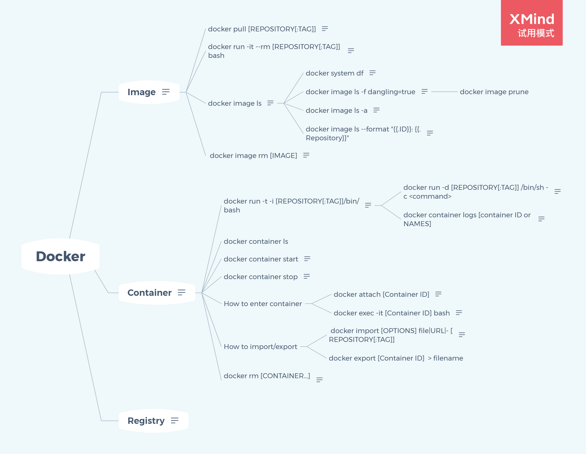

# Docker

## Image

[一个特殊的文件系统]
 包含容器运行时所需的程序、库、资源、配置以及配置参数
 不包含动态数据

### docker pull [REPOSITORY[:TAG]]

docker pull [选项] [Docker Registry 地址[:端口号]/]仓库名[:标签]

### docker run -it --rm [REPOSITORY[:TAG]] bash

-it 执行命令，返回结果，需要一个交互式终端
-i : 交互式操作
-t : 终端
--rm
容器退出后，删除，避免空间的浪费
bash
命令，交互式Shell

### docker image ls

不同的镜像可能会使用相同的基础镜像，所以实际体积会比显示的小

- docker system df

  查看镜像、容器、数据卷所占的空间
   
  

- docker image ls -f dangling=true

  dangling image
  新旧镜像同名，旧镜像 仓库名 tag 均为 <none>
  
  -f 
  $ docker image ls ubuntu:18.04
  $ docker image ls -f since=mongo:3.2
  $ docker image ls -f label=com.example.version=0.1
  
  

	- docker image prune

- docker image ls -a

  显示包含中间层镜在内
  

- docker image ls --format "{{.ID}}: {{.Repository}}"

  按照指定结构输出
  

###  docker image rm [IMAGE]

镜像短 ID、镜像长完整ID、镜像名 或者 镜像摘要

先 untagged，再进行delete
如果还有别的标签指向这个镜像，那么Delete行为不会发生
$ docker image rm $(docker image ls -q redis)

## Container

[进程]
Image  Container  ---> Class  Instance
容器是镜像运行时的实体
创建、启动、停止、删除、暂停
运行于独立的namespace
容器存储层
 生命周期和容器一样，保存于此的信息会被删除
 文件读写， Volumn，挂载主机目录

### docker run -t -i [REPOSITORY[:TAG]]/bin/bash

`docker run` 
是否存在指定image，没有从registry上下载
利用image创建并启动一个container
分配一个文件系统，在只读image外改在一层壳读写层
宿主主机的网桥接口中桥接一个虚拟接口至容器
地址池配置IP地址个容器
执行指定应用程序
执行后，容器被终止

- docker run -d [REPOSITORY[:TAG]] /bin/sh -c <command>

  `-d`
  使用该参数，启动后会返回一个唯一的id
  容器在后台运行并不会把结果打印到宿主主机上
  
  

- docker container logs [container ID or NAMES]

  获取容器输出信息
  

### docker container ls

### docker container start

启动运行一个已经终止（exited）的容器

### docker container stop

终止运行终中的容器
> 容器中指定的应用终结时，容器也自动终止
> 如果启动了终端，可通过`exit` 或`Ctrl+d`退出，所创建容器立刻终止

### How to enter container

- docker attach [Container ID]

  stdin        standard input
  stdout      standard output
  stderr       standard error
  在stdio.h中定义
  
  此处stdin中exit，容器停止
  

- docker exec -it [Container ID] bash

  可跟多个参数
  
  此处stdin中exit，容器不会停止
  

### How to import/export

-  docker import [OPTIONS] file|URL|- [REPOSITORY[:TAG]]

  `docker load`
  导入镜像存储文件到本地镜像库（保存完整记录）
  `docker import`
  导入容器快照到本地镜像库（丢弃历史记录和元数据信息）
  
  

- docker export [Container ID]  > filename

### docker rm [CONTAINER...]

`$ docker container prune`
清楚所有处于终止状态的容器

## Registry

Docker Registry    Repository  Tag
                        1：N            1：N
(Ta-->image)
<Repository name>:<Tag> 指定版本

*XMind - Trial Version*
