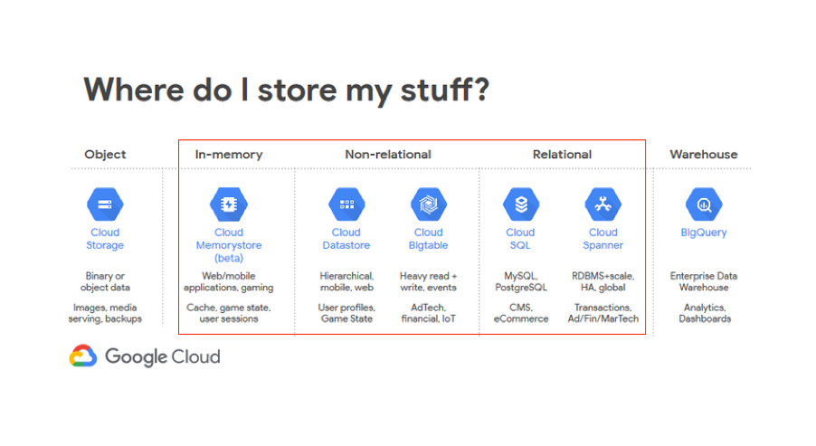
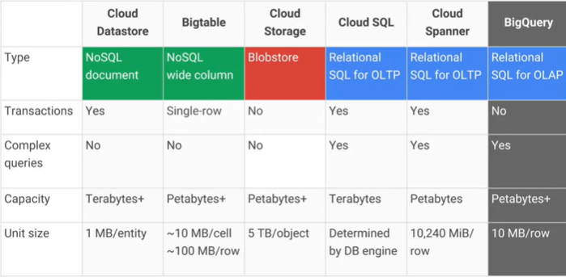
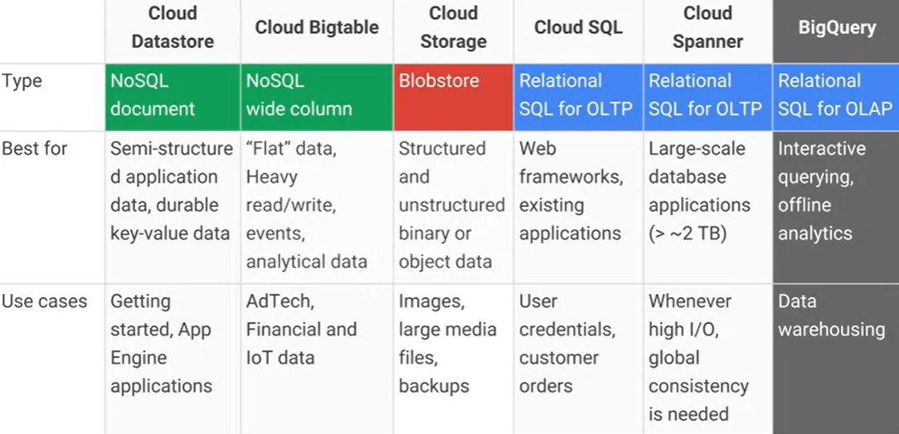
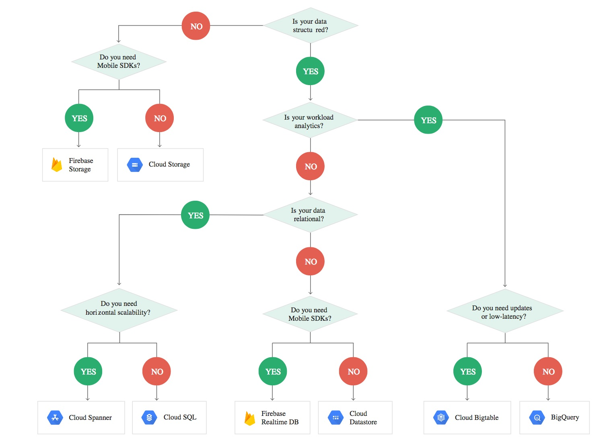

<h1 align='center'>Google Cloud Storage</h1>

<h2>SQL Databases</h2>

* Cloud SQL

  Hosted service for **monolithic MySQL and PostgreSQL**.
  
  Good for monolithic On-Line Transaction Processing(OLTP) apps such as content management systems, Customer Relationship Management and Enterprise Resource Planning.
  IOPS up, storage more -> no horizontal write scalability -> rewrite application

* Cloud Spanner
  
  **Globally distributed**, highly available **relational** database 
  
  Good for OLTP(retail product catalog, SaaS user identity and online gaming.
  
<h2>NoSQL Databases</h2>

* Cloud BigTable

  **Single-region, highly-scalable, wide-column NoSQL service with low latency and high throughput.** 
  
  BigTable which has disk-based persistence is optimized for high volumes of data and analytics.
  
  Good for timeseries-like Hybrid Transactional/Analytical Processing (HTAP) apps that do not require multi-region deployments
  
* Cloud Datastore

  Highly scalable NoSQL database, it can support for single-region/multi-region
  
  Datastore is optimized to serve high-value transactional data to applications.
  
* Cloud Memorystore (Beta)

  Redis compatible **in-memory data** store to build app caches with sub-ms latency
  
  Not recommended for storing data

REFERENCE:
* https://blog.yugabyte.com/new-to-google-cloud-databases-5-areas-of-confusion-that-you-better-be-aware-of/
* https://stackoverflow.com/questions/30085326/google-cloud-bigtable-vs-google-cloud-datastore
